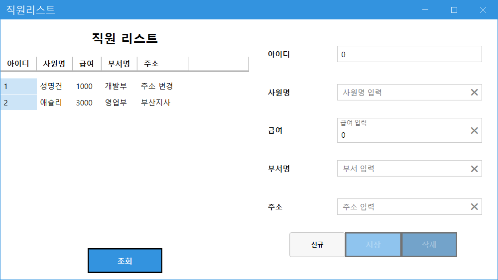
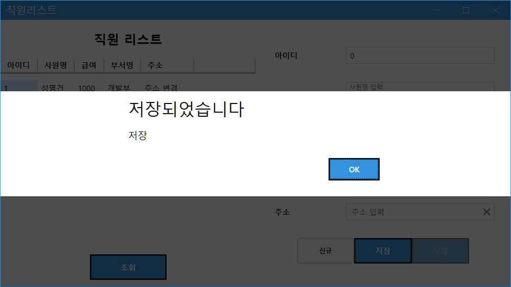
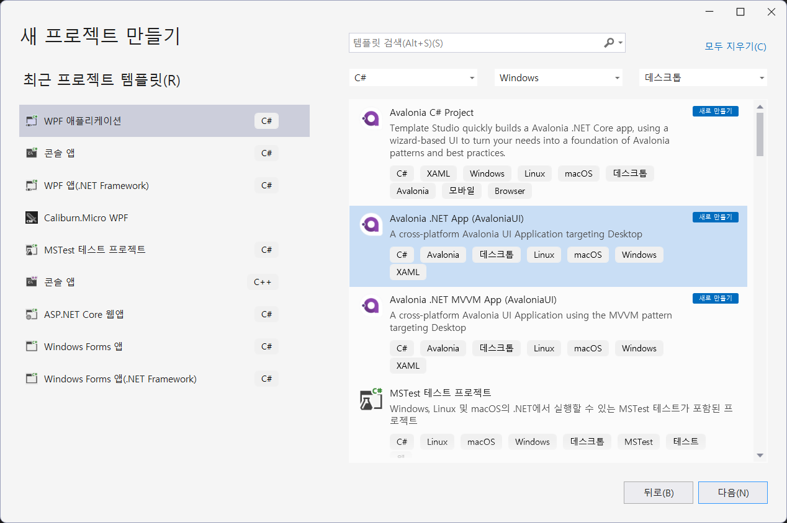
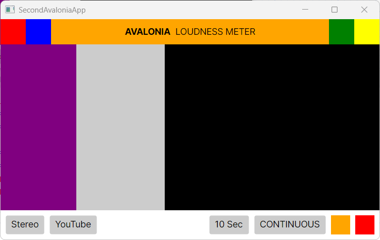
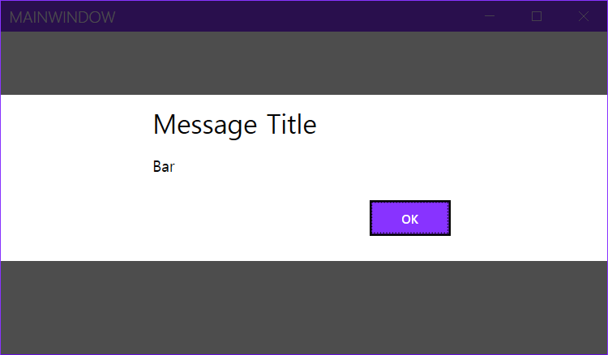
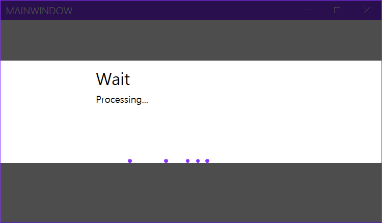
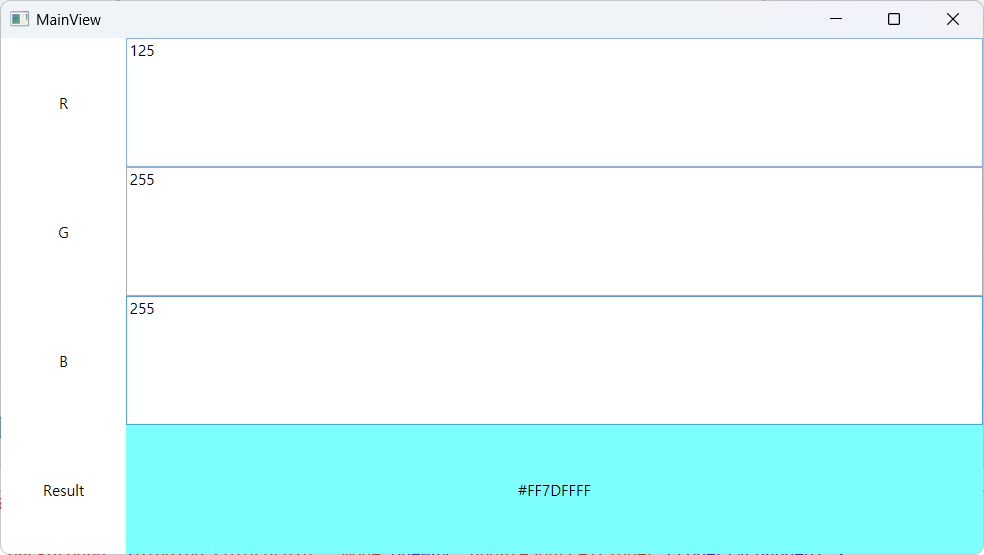

# study-wpf-mvvm
WPF MVVM 학습 리포지토리

## Basic Caliburn
- Caliburn.Micro 패키지 사용
	- NuGet 패키지 Caliburn.Micro 설치(.NET Framework, .NET 6.0 모두 사용 가능)

### CaliburnStartup
- Caliburn.Micro 로 MVVM 기본 구현

### EmployeeMngApp
- SQLServer와 데이터바인딩 확인

	

- 다이얼로그 문제 해결

	

## Basic Avaloina
- Avalonia for Visual Studio 2022 설치
	- https://marketplace.visualstudio.com/items?itemName=AvaloniaTeam.AvaloniaVS 

- on Powershell

	```shell
	> dotnet new install Avalonia.Templates  # 가져오기
	...
	> dotnet new list 						# 리스트 확인
	...
	> dotnet new avalonia.mvvm -o GetStartedApp  # 특정 위치에서 실행하여 전체 프로젝트 스케폴딩
	```

- Visual Studio 실행 
	
	

- Youtube AvaloniaUI

	

## Basic CommunityToolkit.Mvvm

- MahApps.Metro Dialog

	

	

## ReactiveUI

1. WPF 프로젝트
2. NuGet Package 설치
	- ReactiveUI
	- ReactiveUI.WPF

	